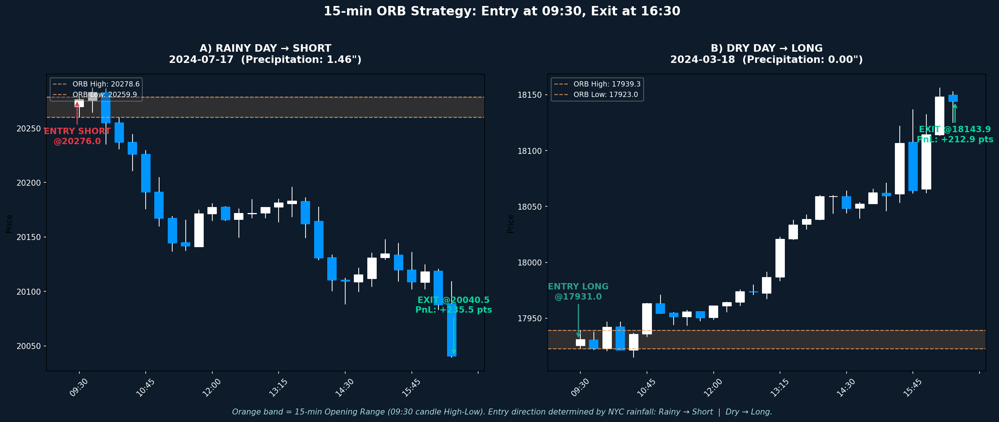
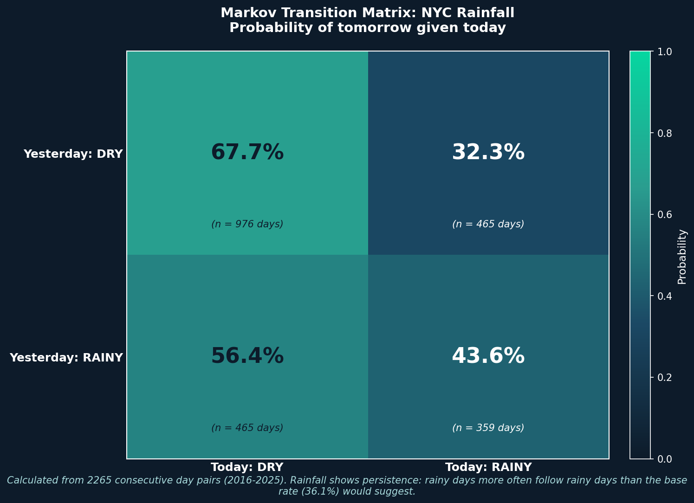
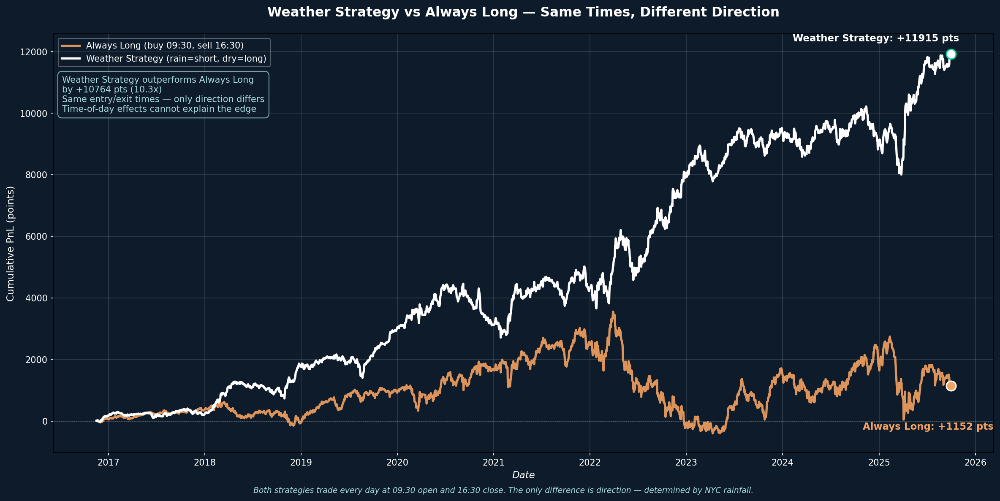
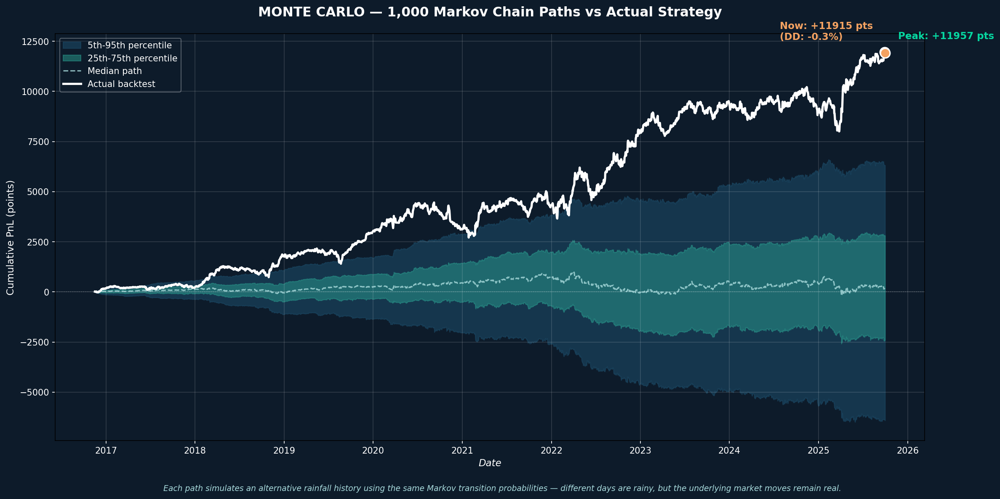
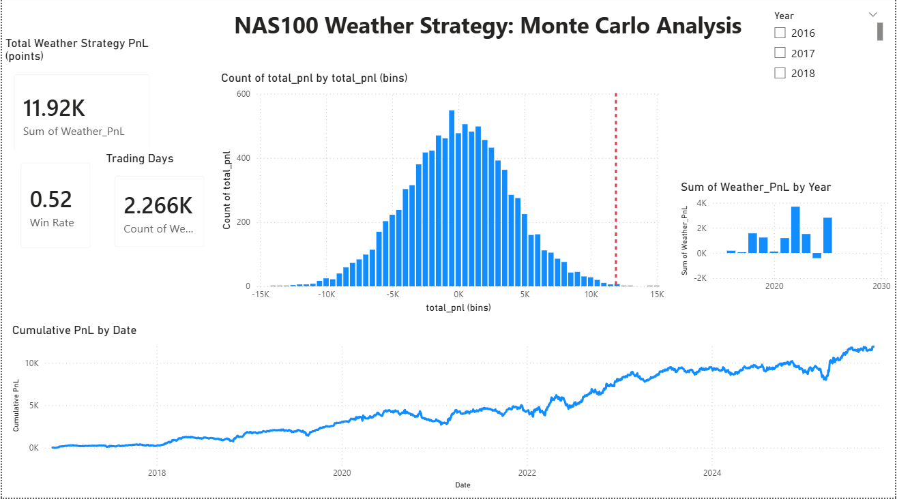

# NAS100 Weather Strategy: A Monte Carlo Investigation

## Project Overview

This project investigates an unconventional hypothesis: **does rainfall in New York City correlate with the daily direction of the NAS100 index?**

Using 9 years of 15-minute NAS100 futures data (2016–2025) and NOAA Central Park weather records, I built a complete analytical pipeline combining Python, SQL, and Power BI to test this hypothesis through Monte Carlo simulation.

## The Strategy

A simple, fully-defined trading rule:
- **Rainy day** (any precipitation > 0): Short position at 09:30 ORB Close, exit at 16:30 Close
- **Dry day** (no precipitation): Long position at 09:30 ORB Close, exit at 16:30 Close

The orange band represents the 15-minute Opening Range (09:30 candle High-Low). Entry direction is determined by NYC weather data, exit is fixed at the 16:30 daily close. 

**Question:** Does this weather-based signal outperform random selection (a coin flip)?

## Methodology

1. **Data Collection** — NAS100 15-minute OHLC data (~207k rows) + NOAA daily precipitation data for NYC Central Park (3,256 days)
2. **Data Engineering** — Filter to 09:30 and 16:30 candles, pivot into daily view, merge with weather data, handle early closes
3. **Strategy Logic** — Apply Long/Short direction based on precipitation, calculate PnL
4. **Markov Chain Modeling** — Compute rainfall transition probabilities (rainy→rainy, dry→rainy)

The matrix shows that rainfall has **persistence**: rainy days follow rainy days at 43.6%, well above the base rate of 36.1%. This justifies using a Markov chain (rather than independent random sampling) to generate realistic synthetic rainfall histories.

5. **Monte Carlo Simulation** — Generate 10,000 synthetic rainfall histories using the Markov matrix, apply the strategy to each, compare real results against the distribution
6. **Interactive Dashboard** — Power BI visualization connected to SQLite database

## Key Results

| Metric | Value |
|--------|-------|
| Total trading days analyzed | 2,266 |
| Total Weather Strategy PnL | +11,915 points |
| Average PnL per trade | +5.26 points (~0.043%) |
| Win rate | 52.4% |
| Always Long benchmark | +1,152 points |
| Outperformance vs Always Long | **10.3x** |
| Monte Carlo percentile | **99.86%** |
| Rainy day average move | -6.53 points |
| Dry day average move | +4.53 points |
| Short win rate (rainy days) | 50.4% |
| Long win rate (dry days) | 53.5% |

**Interpretation:** Out of 10,000 simulated alternative worlds (where rainfall follows the same Markov structure but falls on different days), only ~14 produced a higher PnL than the real world. This places the observed result in the extreme tail of the simulated distribution — a statistically unusual outcome, even if the explanation remains unclear.

At the same time, the underlying win rates remain close to a coin flip (50.4% on rainy days, 53.5% on dry days), suggesting that any apparent "edge" is subtle at best. Either way, while the model might tempt a gambler to check the weather forecast before placing a trade, the more reasonable takeaway is that unusual patterns can emerge surprisingly easily.

The chart above compares the Weather Strategy against an Always Long benchmark — same entry at 09:30, same exit at 16:30, every single day. The only difference is direction. Note that buy-and-hold over this period would have captured the full NAS100 bull run — but both strategies here trade intraday only, capturing no overnight moves. Within that constrained universe, the Weather Strategy outperformed Always Long by 10.3x, suggesting the rainfall signal carries genuine directional information rather than simply capturing intraday drift.

## Visual: Strategy vs Markov-Generated Alternatives

The white line represents the actual strategy's cumulative PnL. The blue/teal bands show the distribution of 10,000 simulated alternative rainfall histories generated using the same Markov transition probabilities. The actual strategy spends nearly the entire 9-year period above the 95th percentile band — an outcome highly unlikely under random rainfall patterns.

## Dashboard Preview

Built in Power BI on top of the SQLite database. Filters by year, shows daily PnL distribution histogram, cumulative equity curve, and annual breakdown.

## Important Limitations

This analysis is an **academic exploration**, not a tradeable strategy:

- **Look-ahead bias**: Same-day precipitation totals are used, which include rainfall occurring after market close. A production version would use weather forecasts (which are ~85% accurate over 24h) or morning-only precipitation
- **Confounding variables**: The observed correlation may reflect seasonal effects, volatility regimes, or other hidden factors rather than a direct weather→market relationship
- **No out-of-sample validation**: The entire 2016–2025 period was used for both modeling and testing
- **Academic literature notes** similar effects (Saunders 1993, Hirshleifer & Shumway 2003 on weather/sentiment effects in markets), though mechanisms remain debated

## Tech Stack

- **Python** (pandas, numpy, matplotlib, mplfinance) — data processing, Monte Carlo simulation, visualizations
- **SQLite** — relational storage of all processed data
- **Power BI** — interactive dashboard
- **Jupyter Notebook** — analytical workflow and documentation

## Project Structure

    nq-monte-carlo-analysis/
    ├── 01_data_exploration.ipynb     # Data loading, cleaning, strategy logic, Monte Carlo
    ├── 02_sql_setup.ipynb            # SQLite database creation and SQL queries
    ├── nq_15min.csv                  # Raw NAS100 15-minute data
    ├── nyc_weather.csv               # Raw NOAA precipitation data
    ├── nq_project.db                 # SQLite database with all processed tables
    ├── nq_monte_carlo_dashboard.pbix # Power BI interactive dashboard
    ├── exports/                      # CSV exports for Power BI
    ├── strategy_illustration.png     # Strategy explanation visual
    ├── markov_matrix.png             # Markov transition probabilities
    ├── monte_carlo_paths.png         # Monte Carlo simulation results
    ├── always_long_vs_weather.png    # Long vs strategy comparison
    ├── NQ 2016-2025.xlsx             # Excel reference file with merged NQ + weather data
    ├── nq_project.sqbpro             # DB Browser for SQLite project file (saved queries)
    └── dashboard_screenshot.png      # Power BI dashboard preview

## How to Reproduce

1. Clone this repository
2. Install dependencies: `pip install pandas numpy matplotlib mplfinance`
3. Open `01_data_exploration.ipynb` in Jupyter, run all cells
4. Open `02_sql_setup.ipynb`, run all cells to rebuild the SQLite database
5. Open `nq_monte_carlo_dashboard.pbix` in Power BI Desktop

## Motivation

This project is a hands-on exploration of data science and engineering fundamentals. As a beginner in the field, I wanted to move beyond simple tutorials and build a complete, end-to-end analytical pipeline from scratch.  It started as a personal challenge — I wanted to work with a large, real-world dataset that spanned multiple data sources and required a full analytical pipeline from raw data to visual output. The hypothesis itself (does NYC rainfall predict NAS100 direction?) was chosen deliberately for its absurdity. Along the way I got hands-on experience connecting disparate data sources, managing ~207k rows of tick data in SQL, building Monte Carlo simulations in Python, and publishing interactive dashboards in Power BI. The goal was not to find a real trading strategy, but to demonstrate how modern tools can be used to systematically investigate any idea while maintaining a critical and objective mindset.  
